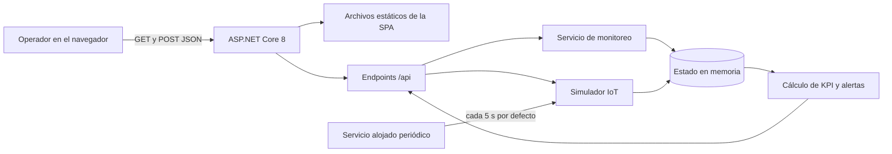
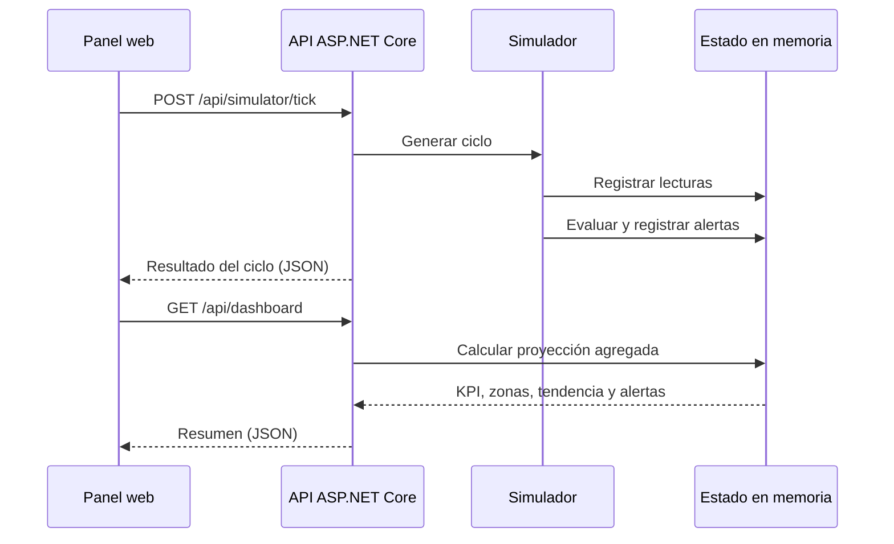

# Arquitectura del monitoreo energético distrital

## Objetivo y alcance

El sistema demuestra cómo llevar telemetría de medidores IoT hasta un panel distrital. El MVP prioriza una instalación sencilla: un solo proceso ASP.NET Core 8 sirve la interfaz, expone la API y mantiene los datos en memoria. Esto permite estudiar y modificar el flujo antes de introducir un broker, una base de datos o infraestructura de nube.

El MVP sí cubre:

- un distrito dividido en zonas;
- medidores asociados a cada zona;
- lecturas eléctricas simuladas;
- agregados y tendencia de demanda;
- generación y visualización de alertas;
- una API REST y un panel web adaptable.

Quedan fuera del alcance inicial el control remoto de equipos, la facturación, la medición legal, la alta disponibilidad, la identidad real de dispositivos y la conservación permanente de datos.

## Vista lógica del MVP



La interfaz estática vive bajo `wwwroot` y se sirve en `/`. Su JavaScript consulta el mismo origen cada 5 segundos, por lo que el prototipo no necesita CORS. Un servicio alojado genera telemetría cada 5 segundos de forma predeterminada; `Simulation:IntervalSeconds` permite configurar el intervalo entre 1 y 300 segundos. El botón **Simular lectura** invoca `POST /api/simulator/tick` para adelantar un ciclo; después, la interfaz vuelve a solicitar el resumen y las colecciones.

## Componentes

### Presentación

Una SPA ligera de HTML, CSS y JavaScript, sin proceso de compilación frontend. Presenta KPI, mapa operativo, tendencia, participación por zona, medidores y alertas. El mapa usa coordenadas del backend para ubicar cada nodo y mantiene una representación esquemática si el proveedor cartográfico no está disponible. La interfaz representa de manera explícita sus estados de carga, datos vacíos y error de red.

### API ASP.NET Core

La aplicación `EnergiaDistrital.Api` concentra el alojamiento web y los endpoints. Serializa JSON en `camelCase` y representa las enumeraciones como cadenas legibles. `/health` ofrece una comprobación mínima separada del estado funcional del panel.

### Dominio y aplicación

Los modelos principales son:

| Entidad | Responsabilidad |
|---|---|
| Distrito | Identidad, nombre, población y superficie del área observada. |
| Zona | Agrupación territorial de medidores y consumo. |
| Medidor | Dispositivo lógico, ubicación, zona y estado operativo. |
| Lectura | Muestra temporal de potencia, energía y calidad eléctrica. |
| Alerta | Evento derivado de una condición anómala o umbral. |
| Resumen | Proyección de KPI, distribución por zona, tendencia y alertas recientes. |

El servicio de monitoreo es la única puerta al estado en memoria. Esta frontera permite sustituir posteriormente el almacenamiento sin cambiar el contrato HTTP ni la interfaz.

### Simulador

El simulador representa el comportamiento de dispositivos IoT. Cada ciclo genera nuevas muestras para los medidores simulados, actualiza los acumulados y evalúa las reglas de alerta. Los valores no tienen validez operativa: solo permiten observar cambios coherentes en el panel.

## Flujo de una lectura simulada



El tiempo se expresa en UTC en el contrato (`timestampUtc`, `generatedAtUtc`). La interfaz puede convertirlo a la zona horaria del navegador únicamente para presentación.

## Contratos HTTP

| Método | Ruta | Resultado esperado |
|---|---|---|
| `GET` | `/health` | Respuesta satisfactoria si el host está disponible. |
| `GET` | `/api/dashboard` | Proyección agregada del estado actual. |
| `GET` | `/api/zones` | Colección de zonas. |
| `GET` | `/api/meters` | Colección de medidores. |
| `GET` | `/api/map` | Vista geográfica con límites, zonas y nodos IoT. |
| `GET` | `/api/readings?limit=50` | Colección reciente; `limit` admite de 1 a 500 y su valor predeterminado es 50. |
| `GET` | `/api/alerts` | Colección de alertas. |
| `POST` | `/api/simulator/tick` | Genera y devuelve un nuevo ciclo. |

El resumen de `/api/dashboard` contiene:

- `district`: identidad y datos generales;
- `generatedAtUtc`: instante de generación;
- `kpis`: demanda actual, energía del día, voltaje promedio, factor de potencia, disponibilidad, alertas, costo estimado y moneda;
- `consumptionByZone`: demanda, energía, participación y alertas por zona;
- `demandTrend`: puntos temporales de potencia;
- `recentAlerts`: alertas que requieren atención inmediata.

Para mantener estable a la interfaz, los cambios futuros deberían ser aditivos. Una ruptura del contrato debe introducir una nueva versión de API o una migración coordinada.

Las rutas de colecciones devuelven arreglos JSON directamente. Si `limit` queda fuera del intervalo admitido, `/api/readings` devuelve HTTP `400` con un objeto `error` en lugar de corregir silenciosamente el valor.

## Propiedades de calidad del ejercicio

- **Simplicidad:** una solución y un proceso, sin servicios externos obligatorios.
- **Reproducibilidad:** datos iniciales conocidos y un endpoint explícito para avanzar la simulación.
- **Separación:** presentación, API, modelos y servicio de estado tienen responsabilidades distintas.
- **Verificabilidad:** `/health` y `scripts/smoke-test.ps1` comprueban el recorrido HTTP básico.
- **Portabilidad:** .NET 8 y archivos web estándar funcionan en Windows, Linux y contenedores.

La memoria del proceso es intencionadamente volátil. Reiniciar la aplicación restablece el ejercicio y no debe interpretarse como pérdida accidental de datos.

## Evolución hacia una plataforma IoT

### 1. Entrada por MQTT

El simulador puede reemplazarse o convivir con un consumidor alojado de MQTT:

```text
Medidor → broker MQTT → consumidor ASP.NET Core → validación → almacenamiento
```

Una convención inicial de tema podría ser:

```text
district/{districtId}/zone/{zoneId}/meter/{meterId}/telemetry
```

Decisiones necesarias antes de conectar equipos reales:

- TLS y credenciales o certificados distintos por dispositivo;
- autorización de publicación restringida al tema de cada medidor;
- QoS acorde al costo de duplicar o perder una muestra;
- identificador de mensaje e idempotencia ante reentregas;
- límites de tamaño, validación de esquema y rechazo de marcas de tiempo inválidas;
- cola de errores para telemetría que no se pueda procesar;
- política para dispositivos desconectados y datos recibidos fuera de orden.

El consumidor no debería calcular el panel dentro del callback MQTT. Conviene validar, normalizar y almacenar primero, y actualizar proyecciones de manera independiente para absorber ráfagas.

### 2. Persistencia en PostgreSQL

Una primera separación de tablas puede incluir:

```text
districts  1 ── N zones  1 ── N meters  1 ── N readings
                                      └── N alerts
```

Recomendaciones:

- claves estables para distrito, zona y medidor;
- `timestamp with time zone` para instantes de lectura;
- índice compuesto de lecturas por `(meter_id, timestamp_utc DESC)`;
- restricción única de idempotencia para evitar muestras repetidas;
- importes en `numeric`, nunca en punto flotante;
- retención o particionado mensual para el volumen histórico;
- migraciones versionadas y copias de seguridad verificadas;
- usuario de aplicación con privilegios mínimos.

En .NET, el servicio en memoria puede sustituirse por repositorios sobre EF Core y Npgsql. Las consultas del dashboard deben proyectar solo el intervalo necesario; para volúmenes grandes, conviene mantener agregados por minuto/hora y no recorrer todas las lecturas crudas.

### 3. Operación y seguridad

Antes de un entorno real se requieren, como mínimo:

- autenticación del operador y roles de lectura/administración;
- protección del endpoint que provoca simulación o acciones administrativas;
- HTTPS, cabeceras seguras y gestión externa de secretos;
- registro estructurado sin datos sensibles, métricas y trazas distribuidas;
- alarmas por retraso de ingestión, dispositivos sin señal y tasa de errores;
- pruebas de carga, límites de solicitud y estrategia de recuperación;
- revisión de privacidad para ubicaciones y patrones de consumo.

## Ruta incremental sugerida

1. Cubrir reglas y agregaciones con pruebas unitarias.
2. Definir un esquema versionado para el mensaje de telemetría.
3. Incorporar PostgreSQL detrás de una interfaz de almacenamiento.
4. Añadir MQTT en paralelo con el simulador, usando un interruptor de configuración.
5. Proteger usuarios y dispositivos con identidades diferentes.
6. Ejecutar pruebas de integración con contenedores efímeros de broker y base de datos.
7. Medir rendimiento y dimensionar retención antes de desplegar.
