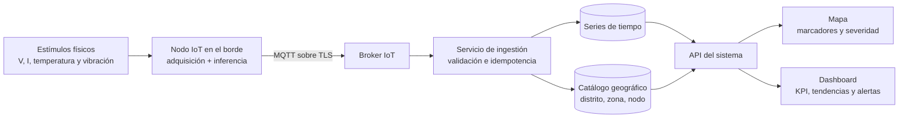
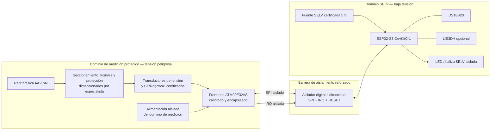
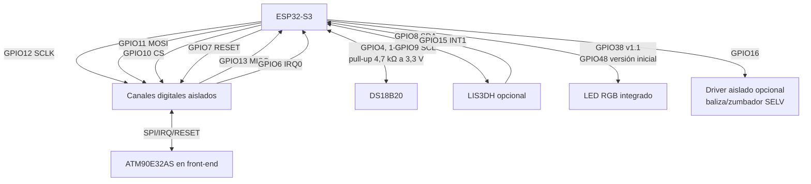
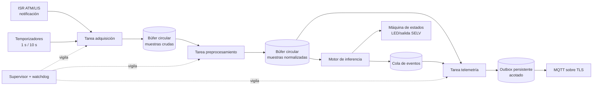

# Sección I: Arquitectura del hardware y firmware embebido

## Propósito y alcance

Esta sección define la extensión física del ejercicio **Monitoreo energético IoT distrital**. El MVP actual genera lecturas simuladas; la arquitectura aquí descrita permite sustituir progresivamente cada medidor simulado por un nodo real basado en **ESP32-S3-DevKitC-1**, un circuito de medición trifásica **ATM90E32AS**, un sensor de temperatura **DS18B20** y, cuando la instalación lo justifique, un acelerómetro **LIS3DH**.

Cada nodo representa un punto geográfico del distrito —por ejemplo, un tablero general, una subestación o un alimentador— y publica mediciones identificadas y georreferenciadas. Por ello, toda señal útil debe terminar en dos vistas complementarias:

- el **mapa**, que muestra ubicación, estado, severidad y resumen instantáneo de cada nodo;
- el **dashboard**, que agrega demanda, energía, calidad eléctrica, temperatura, vibración, disponibilidad y alertas por distrito, zona y medidor.

La propuesta es académica y de prototipado. No constituye un diseño de medidor fiscal, un sistema de protección eléctrica ni una autorización para maniobrar infraestructura real.

> [!CAUTION]
> **Riesgo de electrocución, arco eléctrico e incendio.** Nunca se debe conectar la red de baja o media tensión, ni un divisor resistivo conectado a ella, a una protoboard, al ESP32, a un cable USB o a un instrumento sin la categoría de seguridad correspondiente. La adquisición de tensión y corriente debe realizarse mediante un **front-end de medición trifásica aislado o certificado**, instalado dentro de un gabinete adecuado. Si el ATM90E32AS queda referenciado a la red, su alimentación y todas sus señales digitales deben cruzar una barrera de aislamiento reforzado antes de llegar al ESP32. La selección de transformadores de corriente, fusibles, protección contra sobretensión, distancias de fuga/aislamiento, gabinete, puesta a tierra y categoría de medición corresponde a un ingeniero electricista habilitado. El montaje y las pruebas sobre red deben ser realizados por personal calificado, con procedimientos de bloqueo y verificación de ausencia de tensión. La [guía oficial de la tarjeta de evaluación ATM90E3x](https://ww1.microchip.com/downloads/aemDocuments/documents/SE/ProductDocuments/UserGuides/ATM90E3x-DB%2BUser%2BGuide%2BV1.0.pdf) advierte expresamente sobre su acceso a alta tensión.

## 1.1. Contexto de la solución e integración IoT

### 1.1.1. Problema físico y operativo

La operación de un distrito sin telemetría distribuida suele conocer el consumo con retraso y con poca resolución espacial. Esto dificulta localizar picos de demanda, sobrecargas sostenidas, pérdida o desequilibrio de fases, bajo factor de potencia, calentamiento anormal de gabinetes y fallas incipientes de equipos rotativos. El problema no es únicamente recolectar datos: el nodo debe conservar capacidad de diagnóstico cuando la red IP está interrumpida y debe entregar al operador información asociada a un lugar concreto.

La solución propuesta despliega un nodo por punto de medición. Cada nodo:

1. adquiere magnitudes eléctricas trifásicas mediante un front-end protegido;
2. incorpora temperatura y, de forma opcional, vibración como indicadores de condición;
3. valida, calibra, filtra y resume las señales en el borde;
4. aplica reglas locales para detectar eventos sin esperar al servidor;
5. conserva temporalmente las muestras durante una desconexión;
6. publica telemetría y eventos por MQTT sobre TLS;
7. enlaza cada paquete con `districtId`, `zoneId`, `meterId` y coordenadas provisionadas;
8. alimenta el mapa y el dashboard mediante el backend de la aplicación.



La inferencia local no reemplaza una protección eléctrica. Su finalidad es clasificar la telemetría, reducir latencia de aviso y mantener contexto durante una pérdida de conectividad. Los relés de protección, interruptores y esquemas de disparo certificados permanecen independientes.

### 1.1.2. Estímulos físicos que se capturan

| Prioridad | Estímulo real | Transductor o circuito | Variables obtenidas | Uso en mapa y dashboard |
|---|---|---|---|---|
| Primaria | Tensión alterna de fases A, B y C | Entrada de tensión de un front-end trifásico aislado/certificado basado en ATM90E32AS | `voltageRmsV`, frecuencia, ángulo, hueco de tensión, sobretensión y pérdida de fase | Color/estado del punto; voltaje promedio; detalle por fase; alertas de calidad |
| Primaria | Corriente alterna de fases A, B y C | Transformadores de corriente o bobinas Rogowski especificados por el diseñador del front-end | `currentRmsA`, sobrecorriente, corriente calculada de neutro | Carga del punto, desequilibrio y alerta de sobrecarga |
| Derivada de V e I | Potencia y energía | DSP del ATM90E32AS | Potencia activa, reactiva y aparente, factor de potencia, energía activa/reactiva y sentido del flujo | Demanda distrital, energía diaria, participación por zona, costo estimado y tendencias |
| Secundaria | Temperatura del gabinete o superficie segura del equipo | DS18B20 con alimentación local de 3,3 V | `temperatureC` y alarma térmica | Indicador térmico del marcador, tendencia y alerta por calentamiento |
| Secundaria, opcional | Aceleración/vibración mecánica en transformador, motor, ventilador o gabinete | LIS3DH fijado mecánicamente en el lado de baja tensión | Aceleración X/Y/Z, RMS de vibración, pico y factor de cresta | Salud mecánica, tendencia y evento de vibración anómala |
| Diagnóstico | Estado del propio nodo | ESP32-S3 | RSSI Wi-Fi, reinicios, tiempo activo, cola pendiente, versión de firmware y errores de sensor | Disponibilidad, último contacto y calidad del dato |

El ATM90E32AS integra seis ADC para los tres canales de tensión y los tres de corriente, y calcula potencia, energía, valores RMS, frecuencia, factor de potencia y ángulo de fase. Sus parámetros eléctricos se actualizan aproximadamente a 3 Hz después de promediar 16 ciclos de tensión; estas características proceden de la [hoja de datos oficial de Microchip](https://ww1.microchip.com/downloads/aemDocuments/documents/OTH/ProductDocuments/DataSheets/Atmel-46003-SE-M90E32AS-Datasheet.pdf).

El DS18B20 usa un bus 1-Wire, ofrece resolución programable de 9 a 12 bits y especifica una exactitud de ±0,5 °C entre −10 °C y +85 °C. A 12 bits, una conversión puede tardar hasta 750 ms, según su [hoja de datos oficial de Analog Devices](https://www.analog.com/media/en/technical-documentation/data-sheets/ds18b20.pdf). La temperatura medida corresponde al punto donde se instala el encapsulado; no representa automáticamente la temperatura de un conductor o devanado interno.

El LIS3DH es un acelerómetro digital de tres ejes con I²C/SPI, escalas configurables de ±2 g a ±16 g, FIFO interno y tasas de salida desde 1 Hz hasta 5,3 kHz, de acuerdo con la [hoja de datos oficial de STMicroelectronics](https://www.st.com/resource/en/datasheet/lis3dh.pdf). En este ejercicio se usa para tendencia y detección de cambios; no constituye por sí solo una medición de vibraciones certificada.

**No se capturan señales biométricas, acústicas ni de visión.** No se instalan cámaras ni micrófonos, y el sistema no necesita identificar personas. Esta exclusión reduce superficie de ataque, ancho de banda y riesgos de privacidad.

### 1.1.3. Identidad geográfica y trazabilidad

El ESP32-S3 no necesita GPS en puntos fijos. Durante el aprovisionamiento se registra una ubicación validada en el catálogo del backend. Las coordenadas son metadatos de instalación, no una lectura del sensor, y solo las modifica un rol autorizado.

| Campo | Origen | Regla |
|---|---|---|
| `districtId` | Aprovisionamiento | Identificador estable del distrito |
| `zoneId` | Aprovisionamiento | Zona administrativa o eléctrica del mapa |
| `meterId` / `nodeId` | Identidad del dispositivo | Único; coincide con la autorización del tema MQTT |
| `latitude`, `longitude` | Levantamiento de instalación | Coordenadas WGS84 validadas; no se recalculan en cada muestra |
| `bootId`, `sequence` | Firmware | Permiten detectar reinicios, duplicados y huecos |
| `timestampUtc` | Reloj sincronizado | UTC; se acompaña con una bandera de calidad de tiempo |

El marcador del mapa muestra el último estado conocido y abre el detalle del mismo `meterId` en el dashboard. Los agregados nunca mezclan una muestra con otra zona solo porque el nombre visible sea parecido; se relacionan mediante identificadores estables.

## 1.2. Diseño electrónico y diagramas de conexión

### 1.2.1. Plataforma seleccionada

| Elemento | Selección | Justificación técnica |
|---|---|---|
| Microcontrolador | ESP32-S3-DevKitC-1, preferentemente variante N8R8 para el laboratorio | Wi-Fi de 2,4 GHz y Bluetooth LE integrados; procesador Xtensa LX7 de doble núcleo hasta 240 MHz; SPI, I²C, GPIO y seguridad por hardware. La variante N8R8 incorpora 8 MB de flash y 8 MB de PSRAM, útiles para OTA y búferes. Véanse la [guía de la placa](https://docs.espressif.com/projects/esp-dev-kits/en/latest/esp32s3/esp32-s3-devkitc-1/) y la [hoja de datos del ESP32-S3](https://www.espressif.com/sites/default/files/documentation/esp32-s3_datasheet_en.pdf). |
| Medición eléctrica | ATM90E32AS integrado en un front-end trifásico aislado/certificado | Medición polifásica, interfaz SPI de cuatro hilos, alimentación de 3,3 V y registros de eventos; admite CT o Rogowski. La precisión final depende del circuito, los transductores y la calibración, no solo del integrado. |
| Temperatura | DS18B20 alimentado a 3,3 V, no en modo parásito | Bus 1-Wire sencillo, código único de 64 bits, CRC y resolución configurable. La alimentación local facilita comprobar el fin de conversión y evita el requisito de *strong pull-up* del modo parásito. |
| Vibración | LIS3DH opcional, en módulo compatible con lógica de 3,3 V | Tres ejes, FIFO e interrupciones; I²C permite compartir solo dos líneas. Debe fijarse rígidamente al elemento observado para que la señal sea repetible. |
| Comunicaciones | Wi-Fi + MQTT sobre TLS | Integración directa con broker y segregación por identidad/tema; la cola local desacopla adquisición y red. |
| Indicaciones/actuadores | LED RGB de la placa y salida opcional aislada para baliza o zumbador SELV | Informan estado local. El diseño no acciona cargas de red ni sustituye protecciones. |

La ESP32-S3-DevKitC-1 puede alimentarse por USB, por el pin `5V` o por `3V3`, pero Espressif indica que estas opciones son mutuamente excluyentes. En el prototipo se usa una sola fuente SELV certificada por USB o `5V`; nunca se retroalimentan simultáneamente los rieles. La [guía oficial de la placa v1.1](https://docs.espressif.com/projects/esp-dev-kits/en/latest/esp32s3/esp32-s3-devkitc-1/user_guide_v1.1.html) también advierte que GPIO35, GPIO36 y GPIO37 no están disponibles externamente en variantes con memoria Octal.

### 1.2.2. Separación de dominios eléctricos

El siguiente diagrama es funcional. **No es un plano de cableado de red ni reemplaza un esquema eléctrico firmado.**



Son aceptables dos soluciones, siempre que el fabricante y el diseñador documenten la barrera:

1. un módulo comercial certificado que entregue SPI de 3,3 V ya aislado hacia el ESP32; o
2. una tarjeta de medición en dominio peligroso con fuente aislada y aislador digital reforzado entre el ATM90E32AS y el ESP32.

No es aceptable unir directamente la masa del ATM90E32AS al USB/PC si el circuito de medición está referenciado a la red. Tampoco se conecta el encapsulado metálico de una sonda de temperatura a una barra viva; el sensor se instala en un punto eléctricamente seguro, con método de fijación y aislamiento aprobado.

### 1.2.3. Diagrama lógico de interconexión de baja tensión



### 1.2.4. Asignación propuesta de pines

La matriz GPIO del ESP32-S3 permite enrutar periféricos, por lo que esta asignación prioriza claridad y evita los pines con conflictos conocidos. Debe validarse contra el **código exacto de la placa**, el módulo montado y el esquema final antes de fabricar una PCB.

| Señal | GPIO ESP32-S3 | Dirección desde el ESP32 | Interfaz/nota |
|---|---:|---|---|
| `ATM_CS` | 10 | Salida | Selección SPI, activa en bajo; estado alto durante arranque |
| `ATM_MOSI/SDI` | 11 | Salida | Datos hacia ATM90E32AS, a través del aislador |
| `ATM_SCLK` | 12 | Salida | Reloj SPI, a través del aislador |
| `ATM_MISO/SDO` | 13 | Entrada | Datos desde ATM90E32AS, a través del aislador |
| `ATM_IRQ0` | 6 | Entrada | Evento de calidad eléctrica; aislado; ISR mínima |
| `ATM_RESET_N` | 7 | Salida | Reinicio del medidor; aislado; *pull-up* del lado ATM según hoja de datos |
| `TEMP_DQ` | 4 | Bidireccional, drenador abierto | DS18B20 con *pull-up* aproximado de 4,7 kΩ a 3,3 V |
| `LIS_SDA` | 8 | Bidireccional | I²C; verificar si el módulo ya incluye resistencias *pull-up* |
| `LIS_SCL` | 9 | Salida/bidireccional | I²C; no duplicar *pull-ups* demasiado fuertes |
| `LIS_INT1` | 15 | Entrada | Interrupción de FIFO/umbral; opcional |
| `ALARM_OUT` | 16 | Salida | Solo hacia driver ópticamente aislado de una carga SELV; inactiva al arrancar |
| `STATUS_RGB` | 38 en v1.1; 48 en versión inicial | Salida | Seleccionar la revisión en `board_config.h`; no controlar ambos pines a ciegas |

Pines deliberadamente evitados:

- `GPIO0`, `GPIO3`, `GPIO45` y `GPIO46`, por su función de *strapping* de arranque;
- `GPIO19` y `GPIO20`, para conservar USB D−/D+;
- `GPIO35`, `GPIO36` y `GPIO37`, porque ciertas variantes Octal los usan internamente;
- `GPIO43` y `GPIO44`, para mantener la consola UART disponible;
- `GPIO38` o `GPIO48`, para usos externos, cuando el pin correspondiente controla el LED RGB de la revisión instalada;
- cualquier pin no expuesto o reservado por flash/PSRAM en la variante concreta.

### 1.2.5. Conexiones y condiciones por periférico

| Periférico | Alimentación en prototipo | Conexiones funcionales | Condiciones de diseño |
|---|---|---|---|
| ESP32-S3-DevKitC-1 | Una única entrada USB/5 V SELV | Wi-Fi y GPIO de 3,3 V | Desacoplo local; antena alejada de metal y del dominio de potencia; no exponer USB mientras exista una barrera de aislamiento dudosa |
| ATM90E32AS | 3,3 V en el dominio de medición, suministrados por fuente aislada o incluidos en módulo certificado | SPI de cuatro hilos, `IRQ0`, `RESET`; seis entradas analógicas dentro del front-end | No llevar entradas analógicas a protoboard; respetar circuito de referencia, calibración, protección y aislamiento del proveedor/diseñador |
| DS18B20 | `VDD=3,3 V`, `GND` SELV | `DQ` a GPIO4; *pull-up* aproximado de 4,7 kΩ a 3,3 V | Leer CRC; preferir alimentación local; instalar únicamente en superficie segura y eléctricamente aislada |
| LIS3DH | 3,3 V mediante placa/módulo compatible | I²C a GPIO8/9, `INT1` a GPIO15; `CS` fijado para modo I²C y `SA0` según dirección elegida | Confirmar tensión y *pull-ups* del módulo; montaje rígido y orientación documentada; desacoplo próximo |
| Salida de alarma | Fuente SELV adecuada a la carga | GPIO16 → transistor/driver → optoacoplador o relé de señal certificado | Estado seguro por defecto; diodo de rueda libre si corresponde; no conmutar red ni un contactor de potencia en este ejercicio |

### 1.2.6. Calibración y puesta en servicio

El ATM90E32AS admite correcciones de ganancia y fase por canal, pero la precisión declarada del integrado no convierte automáticamente el conjunto en un medidor preciso. Debe existir un registro de calibración por número de serie que contenga, como mínimo:

- relaciones nominales de CT/Rogowski y del circuito de tensión;
- ganancias, *offsets* y compensaciones de fase aplicadas;
- equipo patrón trazable, fecha, condiciones y responsable;
- errores medidos en varios puntos de carga y factor de potencia;
- versión del firmware y suma de comprobación de la configuración;
- verificación de secuencia y correspondencia A/B/C;
- posición geográfica y fotografías de instalación sin datos personales.

El arranque del firmware compara el CRC de los registros de configuración del ATM90E32AS, verifica valores conocidos y bloquea la publicación de datos como `valid` si la calibración no coincide con el identificador del nodo.

## 1.3. Arquitectura del firmware embebido documentado

### 1.3.1. Principios de diseño

El firmware se propone sobre **ESP-IDF** y FreeRTOS con cuatro reglas:

1. la adquisición nunca espera a la red;
2. una interrupción solo notifica; la lectura y el cálculo se realizan en tareas;
3. todas las muestras llevan calidad, secuencia y tiempo, no solo un valor numérico;
4. una falla de sensor, reloj o comunicación se hace visible tanto en el mapa como en el dashboard.

La placa ofrece aceleración para procesamiento de señales e inferencia, pero la primera versión usa reglas deterministas, auditables y configurables. Un modelo estadístico o TinyML puede añadirse más adelante sin reemplazar las protecciones eléctricas ni ocultar las variables que originan una alarma.

### 1.3.2. Estructura modular propuesta

```text
firmware/
├── CMakeLists.txt
├── sdkconfig.defaults
├── partitions.csv
├── main/
│   ├── app_main.c                 # composición e inicio de tareas
│   ├── board_config.h             # pines y variante de placa
│   └── CMakeLists.txt
├── components/
│   ├── domain/
│   │   ├── measurement.h          # muestra normalizada y banderas de calidad
│   │   ├── event.h                # evento local y severidad
│   │   └── device_identity.h      # distrito, zona, nodo y ubicación
│   ├── drivers/
│   │   ├── atm90e32/              # SPI, registros, CRC, escalado y calibración
│   │   ├── ds18b20/               # 1-Wire, ROM, conversión y CRC
│   │   ├── lis3dh/                # I²C, FIFO, interrupción y auto-prueba
│   │   └── alarm_output/          # LED y salida aislada en estado seguro
│   ├── acquisition/               # instantánea coherente y planificador de muestreo
│   ├── preprocessing/             # validación, filtros, energía e indicadores derivados
│   ├── ring_buffer/               # búfer circular en RAM/PSRAM, sin asignación dinámica
│   ├── inference/                 # reglas, histéresis, persistencia y máquina de estados
│   ├── telemetry/                 # esquema JSON/CBOR, MQTT, outbox e idempotencia
│   ├── connectivity/              # Wi-Fi, TLS, SNTP y reconexión con backoff
│   ├── provisioning/              # identidad y configuración firmada/versionada
│   ├── ota/                       # descarga, validación, cambio de slot y rollback
│   └── health/                    # watchdog, métricas internas y causa de reinicio
└── test/
    ├── test_atm90e32/
    ├── test_filters/
    ├── test_inference/
    └── fixtures/
```

Los drivers solo traducen buses y registros. Las unidades físicas, reglas y contratos de red pertenecen a capas superiores; así pueden probarse con datos grabados sin hardware conectado.

### 1.3.3. Tareas, colas y temporización



| Tarea | Cadencia inicial | Responsabilidad | Restricción |
|---|---:|---|---|
| `atm_acquisition_task` | 1 Hz y por evento `IRQ0` | Leer estado y una instantánea de registros eléctricos | No bloquear por Wi-Fi; reintento SPI limitado |
| `temperature_task` | Cada 10 s | Iniciar conversión DS18B20, esperar de forma no bloqueante y validar CRC | A 12 bits reservar hasta 750 ms sin ocupar CPU |
| `vibration_task` | 100 Hz mediante FIFO, opcional | Vaciar FIFO LIS3DH y formar ventanas | Detectar desbordamiento; no publicar cada muestra cruda |
| `preprocess_task` | Al recibir muestra | Escalar, validar, filtrar y calcular derivados | Conservar dato crudo y banderas para diagnóstico |
| `inference_task` | 1 Hz y ante eventos | Evaluar reglas con histéresis y persistencia | No realizar maniobras de red |
| `telemetry_task` | Resumen cada 5 s; evento inmediato | Serializar, encolar y publicar | QoS y reintentos no frenan adquisición |
| `health_task` | Cada 1 s | Vigilar latidos, memoria, colas, reloj y reinicios | Alimenta watchdog solo si el ciclo esencial progresa |

La frecuencia de 1 Hz no pretende muestrear directamente la onda de 50/60 Hz: el DSP del ATM90E32AS realiza ese trabajo. El firmware lee resultados ya calculados. Los eventos de hueco, sobretensión, pérdida de fase o sobrecorriente se recogen por registro/IRQ para no depender únicamente del sondeo periódico.

### 1.3.4. Modelo de muestra y búfer circular

Una muestra normalizada debe ser inmutable una vez insertada:

```c
typedef struct {
    uint64_t timestamp_utc_ms;
    uint64_t monotonic_ms;
    uint32_t sequence;
    uint32_t quality_flags;
    float voltage_v[3];
    float current_a[3];
    float active_power_w[3];
    float reactive_power_var[3];
    float apparent_power_va[3];
    float power_factor[3];
    float frequency_hz;
    double import_energy_wh;
    double export_energy_wh;
    float temperature_c;
    float vibration_rms_g;
    float vibration_peak_g;
} measurement_t;
```

El búfer circular usa capacidad fija y política **sobrescribir la muestra más antigua**, incrementando un contador `bufferOverrunCount`. Una configuración inicial razonable para laboratorio es 900 muestras eléctricas de 1 s —15 minutos—, ajustada después de medir el tamaño real, la memoria libre y la presencia de PSRAM. No se reserva memoria en el ciclo de adquisición.

Se distinguen dos almacenes:

- **ring buffer en RAM/PSRAM:** contexto reciente para filtros, tendencias e instantáneas pre/postevento;
- **outbox persistente acotado:** mensajes ya resumidos que aún no confirmó el broker. Se escribe por lotes para reducir desgaste de flash, se aplica CRC y se define una política explícita de descarte cuando alcanza el límite.

Un corte de red no puede hacer crecer la cola sin límite. Se preservan primero eventos críticos y resúmenes horarios; la telemetría ordinaria más antigua puede compactarse. El dashboard recibe contadores de pérdida/compactación para no aparentar una serie completa.

### 1.3.5. Lectura, validación y preprocesamiento en tiempo real

#### Canal eléctrico

1. Verificar estado de SPI y configuración del ATM90E32AS.
2. Leer registros de estado antes y después de las magnitudes; si cambian durante la instantánea, repetir una sola vez o marcar `NON_ATOMIC`.
3. Convertir registros con los coeficientes de calibración del nodo y conservar el valor original para diagnóstico.
4. Validar rangos físicos y finitud; una lectura imposible se marca, no se reemplaza silenciosamente por cero.
5. Para visualización, aplicar mediana móvil de tres puntos y luego un EWMA configurable, por ejemplo `α=0,2`.
6. Para alarmas rápidas, evaluar también el registro de evento y el valor sin suavizar. El filtro nunca debe ocultar una pérdida de fase o sobrecorriente.
7. Calcular indicadores: potencia total, desequilibrio de tensión/corriente, demanda en ventana y delta de energía.
8. No filtrar ni integrar nuevamente el contador acumulativo de energía. Si retrocede después de un reinicio, iniciar un nuevo segmento y publicar una bandera; nunca producir energía negativa.

Varios registros de energía del ATM90E32AS tienen semántica de lectura y borrado. El driver es su único propietario: los lee una sola vez, actualiza acumuladores monotónicos y distribuye copias de la instantánea a las demás tareas. Ninguna tarea de dashboard, eventos o diagnóstico debe acceder a esos registros en paralelo.

Una definición documentable del desequilibrio para el ejercicio es:

```text
media = (xA + xB + xC) / 3
desequilibrioPct = 100 × max(|xA-media|, |xB-media|, |xC-media|) / media
```

Esta métrica sirve para tendencia educativa. Si el proyecto adopta un método normativo, el backend, firmware y etiqueta del dashboard deben versionarse juntos para evitar comparar definiciones distintas.

#### Canal térmico

1. Enumerar y comprobar el código ROM esperado del DS18B20.
2. Lanzar `Convert T` y liberar la tarea mientras termina la conversión.
3. Leer *scratchpad* y validar CRC.
4. Rechazar como no inicializada una lectura obtenida antes de completar la primera conversión; el valor de encendido de su registro es +85 °C y podría confundirse con una alarma real.
5. Aplicar una mediana corta solo para presentación; la regla térmica usa persistencia e histéresis.

#### Canal vibracional opcional

1. Configurar LIS3DH inicialmente en ±2 g, 100 Hz y FIFO; aumentar escala si se observa saturación.
2. Registrar orientación física y ejecutar auto-prueba durante mantenimiento, no durante una ventana normal.
3. Vaciar FIFO por interrupción, comprobar saturación y pérdida de muestras.
4. Restar la media por eje en cada ventana para eliminar la componente cuasiestática de gravedad.
5. Calcular RMS vectorial, pico y factor de cresta en ventanas de 2 s; conservar una línea base por equipo y condición operativa.
6. Publicar características resumidas. Las formas de onda crudas se conservan solo alrededor de eventos y con un límite estricto.

### 1.3.6. Motor de inferencia local

El motor usa una máquina de estados `NORMAL → ADVERTENCIA → ALARMA → RECUPERACIÓN`. Cada regla tiene umbral de entrada, umbral de salida, duración mínima, severidad, periodo de silenciamiento y versión de configuración. Los límites definitivos deben ser aprobados para cada instalación; no se codifican como universales.

| Regla | Entradas | Lógica principal | Resultado visible |
|---|---|---|---|
| Sobretensión/subtensión | Tensión RMS y estados ATM | Umbral por fase + persistencia + histéresis | Marcador amarillo/rojo y alerta de calidad |
| Pérdida o secuencia de fase | Registros de evento ATM | Evento inmediato confirmado por segunda lectura | Alarma crítica del nodo |
| Sobrecarga/sobrecorriente | Corriente y potencia por fase | Umbral temporal; evento hardware para condición rápida | Demanda, fase responsable y duración |
| Desequilibrio | V/I por fase | Porcentaje sobre ventana estable | Indicador de balance por nodo/zona |
| Bajo factor de potencia | PF y potencia activa | Ignorar condición de casi cero carga; persistencia | KPI de PF y recomendación de inspección |
| Sobretemperatura | DS18B20 válido | Umbral + histéresis + pendiente | Alerta térmica y tendencia |
| Vibración anómala | RMS, pico y línea base LIS3DH | Desviación sostenida o impacto | Evento mecánico y evidencia pre/post |
| Sensor o nodo degradado | CRC, datos obsoletos, reinicios, cola | Conteo de fallas y tiempo desde última muestra válida | Marcador gris y alerta de mantenimiento |

Las salidas locales se limitan a indicación:

- verde: funcionamiento normal;
- amarillo: advertencia o conectividad degradada;
- rojo: alarma local activa;
- patrón violeta/azul: actualización o aprovisionamiento;
- salida GPIO16: baliza o zumbador SELV mediante driver aislado, deshabilitada de forma predeterminada.

Un comando remoto puede confirmar o silenciar temporalmente una indicación, con autenticación, caducidad, contador anti-repetición y auditoría. **No puede abrir/cerrar un interruptor de potencia.** Una futura actuación sobre contactores requeriría un análisis de riesgos, enclavamientos, circuito de seguridad independiente y equipos certificados fuera del alcance de este ejercicio.

### 1.3.7. Contrato MQTT, TLS y relación con mapa/dashboard

Temas propuestos:

```text
district/{districtId}/zone/{zoneId}/meter/{meterId}/telemetry/v1
district/{districtId}/zone/{zoneId}/meter/{meterId}/events/v1
district/{districtId}/zone/{zoneId}/meter/{meterId}/status/v1
district/{districtId}/zone/{zoneId}/meter/{meterId}/commands/v1
```

Ejemplo de telemetría; las coordenadas pueden omitirse en mensajes sucesivos si el backend resuelve `meterId` contra su catálogo autoritativo:

```json
{
  "schemaVersion": 1,
  "messageId": "01J...",
  "districtId": "district-01",
  "zoneId": "zone-north",
  "meterId": "meter-004",
  "bootId": "b7d1...",
  "sequence": 1842,
  "timestampUtc": "2026-09-01T15:04:05.000Z",
  "location": {
    "latitude": -12.0464,
    "longitude": -77.0428,
    "source": "provisioned"
  },
  "electrical": {
    "voltageRmsV": [229.8, 230.4, 228.9],
    "currentRmsA": [12.4, 11.8, 13.1],
    "activePowerKw": 8.31,
    "reactivePowerKvar": 1.42,
    "powerFactor": 0.986,
    "frequencyHz": 60.01,
    "importEnergyKwh": 1284.337,
    "voltageUnbalancePct": 0.36
  },
  "condition": {
    "temperatureC": 41.2,
    "vibrationRmsG": 0.031
  },
  "quality": {
    "valid": true,
    "flags": [],
    "timeSynchronized": true
  },
  "health": {
    "rssiDbm": -61,
    "uptimeS": 9021,
    "firmwareVersion": "0.1.0",
    "pendingMessages": 0
  }
}
```

El flujo de presentación es determinista:

| Dato del nodo | Mapa | Dashboard |
|---|---|---|
| Identidad y ubicación | Posición y etiqueta del marcador | Filtro y ficha del medidor |
| Potencia activa | Resumen en ventana emergente | Demanda actual, tendencia y participación por zona |
| Energía acumulada/delta | Opcional en detalle | Energía diaria y costo estimado |
| V/I/PF/frecuencia | Severidad del punto | Calidad eléctrica y comparación por fase |
| Temperatura/vibración | Icono o halo de condición | Tendencias y alertas de mantenimiento |
| Estado/último contacto | Color gris si está obsoleto | Disponibilidad, RSSI, versión y cola pendiente |
| Evento local | Marcador parpadeante o rojo según accesibilidad | Lista de alertas con hora, regla, fase y evidencia |

El cliente ESP-MQTT de Espressif soporta MQTT y ejemplos de MQTT sobre TLS con validación del certificado del broker; véase la [documentación oficial de ESP-MQTT](https://docs.espressif.com/projects/esp-idf/en/stable/esp32s3/api-reference/protocols/mqtt.html). Para este diseño:

- el broker se valida con CA confiable o certificado anclado; nunca se desactiva la validación TLS;
- cada nodo usa credenciales o certificado cliente propios y solo puede publicar en su rama de temas;
- telemetría y eventos usan QoS 1 con `messageId`, `bootId` y `sequence` para que el backend elimine duplicados;
- el último estado puede publicarse como retenido y con *Last Will* `offline`; la telemetría histórica no se retiene como “último mensaje” del broker;
- los secretos no se incluyen en Git ni en texto plano; producción habilita NVS cifrada, Secure Boot v2 y cifrado de flash;
- la reconexión aplica espera exponencial con aleatoriedad, y la adquisición continúa durante la caída;
- el backend rechaza coordenadas no autorizadas, marcas de tiempo absurdas, valores fuera de esquema y mensajes cuyo `meterId` no coincida con la identidad TLS.

### 1.3.8. OTA, arranque seguro y recuperación

El esquema de particiones reserva `ota_0`, `ota_1` y `ota_data`. La nueva imagen se escribe en el slot inactivo, se verifica antes de arrancar y solo se marca válida después de completar auto-pruebas de SPI, configuración, tareas esenciales y conectividad. Si falla, el cargador vuelve a la versión anterior. Espressif documenta el proceso y la necesidad de dos slots en [Actualizaciones OTA para ESP32-S3](https://docs.espressif.com/projects/esp-idf/en/stable/esp32s3/api-reference/system/ota.html).

En equipos de producción se combinan:

- **Secure Boot v2**, para ejecutar únicamente bootloader y aplicaciones firmadas;
- **cifrado de flash**, para dificultar la extracción local de firmware y secretos;
- imágenes OTA firmadas, control de versión y política anti-*rollback* cuando el ciclo de soporte esté definido;
- claves de firma fuera del dispositivo y fuera del repositorio.

La activación de eFuses de seguridad puede ser irreversible y se realiza únicamente después de validar el flujo de fabricación y recuperación. La [guía oficial de Secure Boot v2](https://docs.espressif.com/projects/esp-idf/en/stable/esp32s3/security/secure-boot-v2.html) recomienda combinarlo con cifrado de flash.

El Task Watchdog vigila las tareas esenciales. Cada una publica un latido; el supervisor alimenta el watchdog solo si adquisición, preprocesamiento e inferencia avanzaron. Un hilo de telemetría bloqueado no debe detener medición, pero se reporta como degradación. ESP-IDF describe el Interrupt Watchdog y el Task Watchdog en su [documentación de watchdogs](https://docs.espressif.com/projects/esp-idf/en/release-v5.3/esp32s3/api-reference/system/wdts.html).

### 1.3.9. Pseudocódigo del ciclo principal

```c
void app_main(void) {
    board_force_safe_outputs();
    health_init_reset_reason();
    identity = provisioning_load_and_verify();

    ring_buffer_init(FIXED_SAMPLE_CAPACITY);
    outbox_init_with_crc(FIXED_OUTBOX_CAPACITY);

    atm90e32_init_isolated_spi();
    atm90e32_verify_identity_config_and_calibration();
    ds18b20_init_local_power();
    lis3dh_init_if_enabled();

    watchdog_init();
    start_task(acquisition_task);
    start_task(preprocess_task);
    start_task(inference_task);
    start_task(telemetry_task);
    start_task(health_task);
}

void acquisition_task(void *arg) {
    every(1_second) {
        raw = atm90e32_read_consistent_snapshot();
        raw.time = clock_get_utc_and_monotonic();
        raw.quality |= atm90e32_validate_snapshot(raw);

        if (temperature_due()) {
            // Conversión iniciada antes; no bloquear 750 ms dentro de esta sección.
            raw.temperature = ds18b20_finish_crc_and_restart_conversion();
        }

        if (vibration_enabled()) {
            raw.vibration_window = lis3dh_take_completed_fifo_window();
        }

        queue_send_bounded(raw_queue, raw);
        heartbeat(ACQUISITION);
    }
}

void preprocess_task(void *arg) {
    while (queue_receive(raw_queue, &raw)) {
        sample = scale_with_node_calibration(raw);
        validate_ranges_and_mark_quality(&sample);
        preserve_unfiltered_values(&sample);
        median3_then_ewma_for_display(&sample);
        compute_power_energy_delta_unbalance(&sample);
        compute_vibration_features_if_present(&sample);
        ring_buffer_push_overwrite_oldest(&sample);
        queue_send_bounded(inference_queue, sample);
        queue_send_bounded(telemetry_queue, sample);
        heartbeat(PREPROCESSING);
    }
}

void inference_task(void *arg) {
    while (queue_receive(inference_queue, &sample)) {
        events = rules_evaluate_with_hysteresis_and_duration(sample);
        state = alarm_state_machine_update(events, sample.quality);
        alarm_output_apply_safe_indication(state);
        for_each(events, persist_and_enqueue_event);
        heartbeat(INFERENCE);
    }
}

void telemetry_task(void *arg) {
    connectivity_start_tls();
    while (true) {
        move_summaries_and_events_to_outbox();
        if (mqtt_is_authenticated()) {
            publish_oldest_qos1_and_remove_only_after_ack();
        } else {
            reconnect_with_bounded_exponential_backoff();
        }
        heartbeat(TELEMETRY);
        task_delay_short();
    }
}
```

### 1.3.10. Verificación del prototipo

Antes de conectarlo al backend del distrito se ejecutan pruebas con fuentes y simuladores **aislados**, nunca directamente sobre una protoboard conectada a red:

1. pruebas unitarias de escalado, límites, filtros, desbordamiento del ring buffer y reglas;
2. reproducción de vectores conocidos de registros ATM90E32AS y comprobación de unidades;
3. prueba de CRC y desconexión para DS18B20, LIS3DH y configuración del medidor;
4. inyección de pérdida de Wi-Fi/broker y verificación de outbox, orden e idempotencia;
5. reinicio durante adquisición y durante OTA; comprobación de rollback y causa de reinicio;
6. saturación de cola y memoria, confirmando que la adquisición sigue activa y se reporta pérdida;
7. comparación contra un patrón por fase realizada por personal competente;
8. validación extremo a extremo: cada `meterId` aparece en la coordenada correcta del mapa y sus lecturas alimentan exactamente los KPI, tendencias y alertas de su zona;
9. revisión de accesibilidad: la severidad no depende exclusivamente del color del marcador;
10. ensayo de gabinete, temperatura, cobertura Wi-Fi y montaje mecánico antes de despliegue.

### 1.3.11. Criterios de aceptación de la Sección I

La implementación física se considera alineada con esta especificación cuando:

- ninguna parte accesible del ESP32, USB, sensores auxiliares o PC comparte potencial con la red;
- existe documentación del front-end, aislamiento, protecciones y calibración firmada por responsable competente;
- las tres fases se identifican de forma inequívoca y los datos inválidos llevan banderas de calidad;
- el firmware conserva adquisición e inferencia durante una desconexión MQTT;
- una alarma local produce un evento idempotente y aparece en mapa y dashboard con el mismo nodo, hora y severidad;
- el búfer y la outbox tienen límites verificables y reportan descartes;
- las actualizaciones OTA se validan y recuperan una imagen anterior si la nueva no supera auto-pruebas;
- las credenciales son individuales, TLS valida el servidor y no hay secretos en Git;
- los actuadores solo realizan señalización SELV y arrancan en estado seguro.

## Fuentes técnicas primarias

- Espressif Systems, [ESP32-S3-DevKitC-1: guía de usuario y hardware](https://docs.espressif.com/projects/esp-dev-kits/en/latest/esp32s3/esp32-s3-devkitc-1/).
- Espressif Systems, [ESP32-S3 Series Datasheet](https://www.espressif.com/sites/default/files/documentation/esp32-s3_datasheet_en.pdf).
- Espressif Systems, [ESP-MQTT](https://docs.espressif.com/projects/esp-idf/en/stable/esp32s3/api-reference/protocols/mqtt.html).
- Espressif Systems, [Over The Air Updates (OTA)](https://docs.espressif.com/projects/esp-idf/en/stable/esp32s3/api-reference/system/ota.html).
- Espressif Systems, [Secure Boot v2](https://docs.espressif.com/projects/esp-idf/en/stable/esp32s3/security/secure-boot-v2.html).
- Espressif Systems, [Watchdogs del ESP32-S3](https://docs.espressif.com/projects/esp-idf/en/release-v5.3/esp32s3/api-reference/system/wdts.html).
- Microchip Technology, [ATM90E32AS Datasheet](https://ww1.microchip.com/downloads/aemDocuments/documents/OTH/ProductDocuments/DataSheets/Atmel-46003-SE-M90E32AS-Datasheet.pdf).
- Microchip Technology, [AN46103: Application Note for M90E32AS](https://ww1.microchip.com/downloads/aemDocuments/documents/OTH/ApplicationNotes/ApplicationNotes/Atmel-46103-SE-M90E32AS-ApplicationNote.pdf).
- Microchip Technology, [ATM90E3x-DB User Guide](https://ww1.microchip.com/downloads/aemDocuments/documents/SE/ProductDocuments/UserGuides/ATM90E3x-DB%2BUser%2BGuide%2BV1.0.pdf).
- Analog Devices/Maxim Integrated, [DS18B20 Datasheet](https://www.analog.com/media/en/technical-documentation/data-sheets/ds18b20.pdf).
- STMicroelectronics, [LIS3DH Datasheet](https://www.st.com/resource/en/datasheet/lis3dh.pdf).
